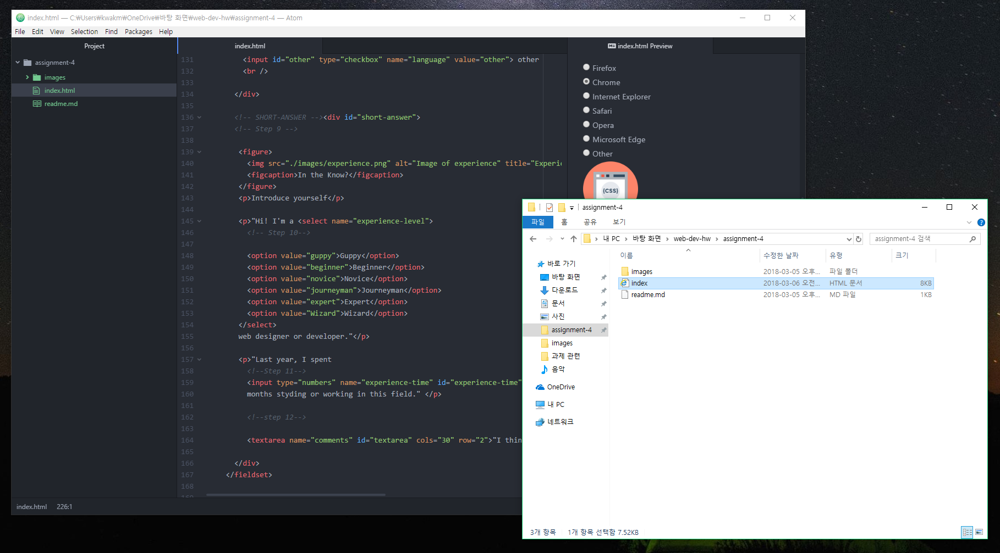

## **Assignment 4 Readme.md**
### **_Min Joon Kwak_**

**What is "alt text," and why do we use it?**

"Alt text" or "alternate text" is the way that describes images with texts or letters visually to make people who is visually handicapped can understand the images easily.

**Describe any forms you've come across while browsing the web. What purposes do the serve?**

I can access a lot of forms through browsing the web. Especially, I always need username and password in the most of websites. For example, when I sign up or in on Github.com, I can see the username and password forms. Through these basic forms, most of website can gather who members are and save their information easily.

**Summarize your work cycle for this assignment. Review this page if you need some ideas.**

This assignment sometimes make me confused. I spent for a long time to do this homework. Making options and choices was very amazing, and easier than I think. Also, making button was interesting and easy. However, when I make the table, it was little confused. I didn't know that I should add ```<th></th>``` for the first space. Because of this, I really felt difficult. I searched a lot and read again and again. Anyway, my results are successful, and I feel really nice for this assignment.


