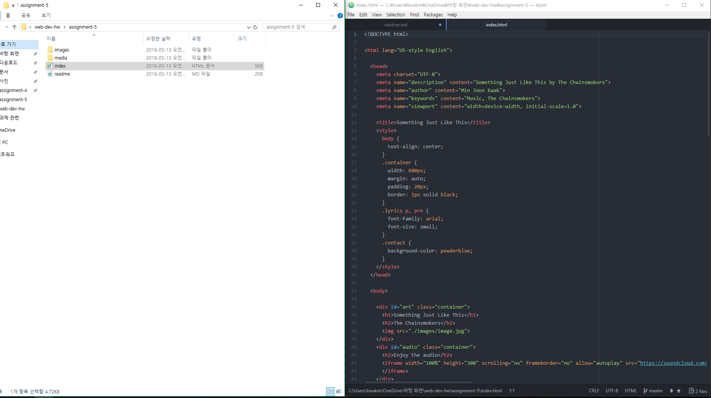

## **Assignment 5 Readme.md**
### **_Min Joon Kwak_**

**Briefly describe the difference between divs, classes, ids, and spans.**
```Divs``` increase structural clarity and identify element groups by providing structure. The ```ids``` are the unique identifier. Then, the ```classes``` are similar with ids. They are an identifier and selector value for HTML elements. The ```spans``` exist within the div element. They serve to identify or group content together that requires extra styling.  


**Why might I consider third-party over self-hosted media?**

Because third-party uses less bandwidth unlike self-hosted media.

**Summarize your work cycle for this assignment.**

I followed the instructions generally. Sometimes searching Google was helpful for my live site. Some confused codes made me searched a lot, and I could complete. However, I suffered difficulty about inserting soundtrack. The site that instructor recommended was very unfamiliar for me and I don't know how to use it. Although I searched my song, _Something Just Like This_, and I inserted the link. However, my live site couldn't show that one. I don't know what problem is in this process.


