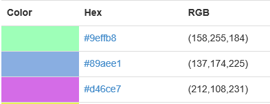
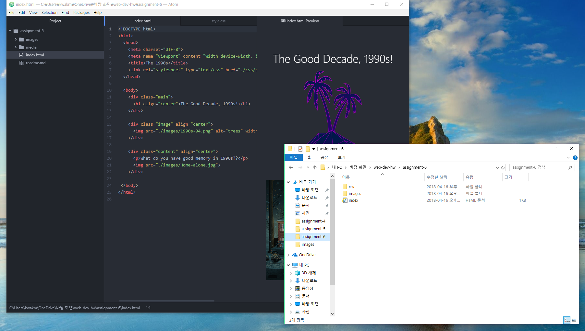

## **Assignment 6 Readme.md**
### **_Min Joon Kwak_**

**Briefly share your design process for this assignment. What graphic or graphics did you choose, from what decade?
 How did you try to style your "art page" to reflect your exploration of this decade's design trends?**

 Actually, I felt familiar about 1990s because I was a child in 1990s and I have a lot of good memories about 1990s. Thus, I chose 1990s and the trees image. It looks really familiar and pretty image. To decorate my art page, I wanted to look for related picture with 1990s. I love movies, and I could find a picture of _Home Alone_. Then, by decorating the background and fonts with colors, I could complete my own art page.

**Describe your color palette, including the 3 colors you chose. List their color names, rgb values, or hex codes.**



**Summarize your work cycle for this assignment. Review this page if you need some ideas.**

Sometimes, I suffered confusion about this assignment.
Because of this, I read the instructions repeatedly. I felt that it is easier and simpler than I thought to complete ```style.css```. Although I spent a lot of time to understand about css, I could finish simply. Instructions and example were really good explanations for me.

