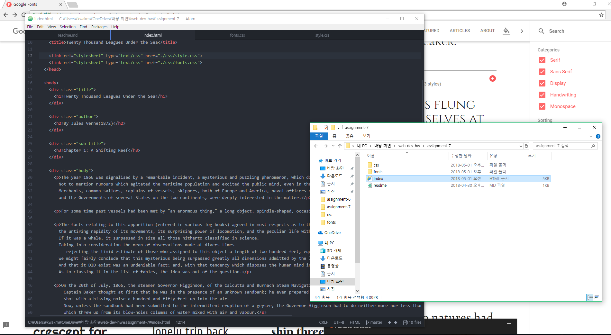

## **Assignment 7 Readme.md**
### **_Min Joon Kwak_**

**Briefly share your design process for this assignment. What fonts did you choose, and why?**

I chose two fonts, "Lobster" and "Comfortaa". This is because, I thought that Lobster font is suitable with the book, _Twenty Thousand Leagues Under the Sea_ and with the sea that is the background of this book. Also, I thought Comfortaa font looks very clear and easy to read for viewers, so it was chosen.

**What is the difference between a system font, web font, and web-safe font?
What is the importance of having fallback fonts or a font stack?**

System font is already installed font on computer. Web font is usable font even though it is not installed on computer. Web-safe font is seen every computer such as Arial, Calibri, and so on.

**Summarize your work cycle for this assignment. Review this page if you need some ideas.**

First, according to the instructions, I chose the book and author. I don't know well about Verne and his book, but I wonder about the story and it looks really fun. After I put the all contents on ```index.html``` page, I started to decorate with ```css```. I want to take deep sea color, so I got navy color. After I completed the ```style.css```, I completed ```fonts.css```. ```Fonts.css``` is easier than I think. It was simple and codes are interesting. Although I suffered confusions about the codes of ```style.css```, I could finish barely.


