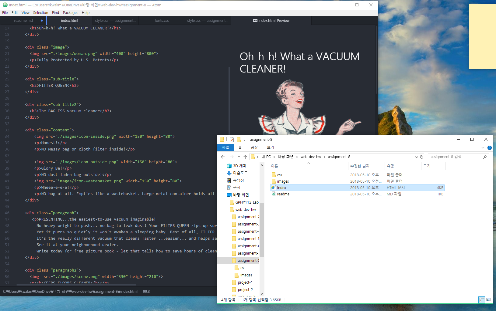

## **Assignment 8 Readme.md**
### **_Min Joon Kwak_**

**What is the difference between padding, margin, and borders?**

padding and margin are codes that control the spaces. There is a difference about it. For example, if I use padding, I increase or decrease space of "box" inside. On the other hand, if I use margin, I can increase or decrease the spaces of "box" outside. Border is the "line" that divide the external space and the internal space. I can decide the style of the line and size of the line by using border code.

**What was the hardest task for you to accomplish this assignment? For example, was it overlapping elements, working with muliple fonts, creating layout, or something else entriely?**

It was difficult to decide sizes and locations like the original picture.
Because of this, I spent a lot of time for styling my page.

**Summarize your work cycle for this assignment. Review this page if you need some ideas.**

The instructions are really simple. Unlike before, I need to think about it by myself. First, I think about the structure how I divide with ```div``` elements. Then, I completed the index first. Next, I decorated with ```css```. Sometimes I suffered difficulty about how I order to arrange my items correctly. During making css, I needed to modify my ```index.html``` little by little. Also, I considered the sizes of my items. After completion, I checked my elements with the instructions. Sometimes I felt it is cumbersome, but it was interesting try.


