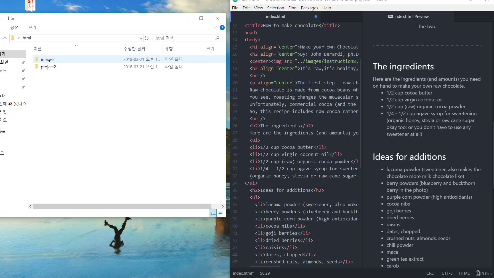

## **Project 2 Readme.md**
### **_Min Joon Kwak_**

**Briefly recap your experience learning HTML. What was old, new, interesting, or difficult to learn?**

This project was very long and interesting for me. I spent a lot of time for this project, and I could learn HTML a lot during making my own website. I thought assignments were really helpful for this project. For example, the table and inserting video were familiar. By using experience of assignment 4 and 5, I could complete easily. On the other hand, inserting map was very new for me. It was simpler than I thought and very interesting to learn.

**Next Topic we begin CSS and expand on styling, which helps us "decorate" HTML. Is there anything you're anxious or excited to learn about in this new section?**

I know we can decorate HTML by using and linking CSS. I think that making CSS and linking are more difficult than assignments that I completed before. Thus, I am anxious about next topic. I think that I need a lot of time to learn the next topic.

**Summarize your work cycle for this assignment. Review this page if you need some ideas.**

It was really long, and I need a lot of time because I need to make 3 pages unlike before. Thus, by using a lot of times, I understand this project generally. And then, I struggle to understand and follow the instructions on Moodle. When I sometimes suffered confusions, the examples on Moodle were very helpful for me. I referenced my experiences, the examples, and instructor's messages, and I could finally completed.  

